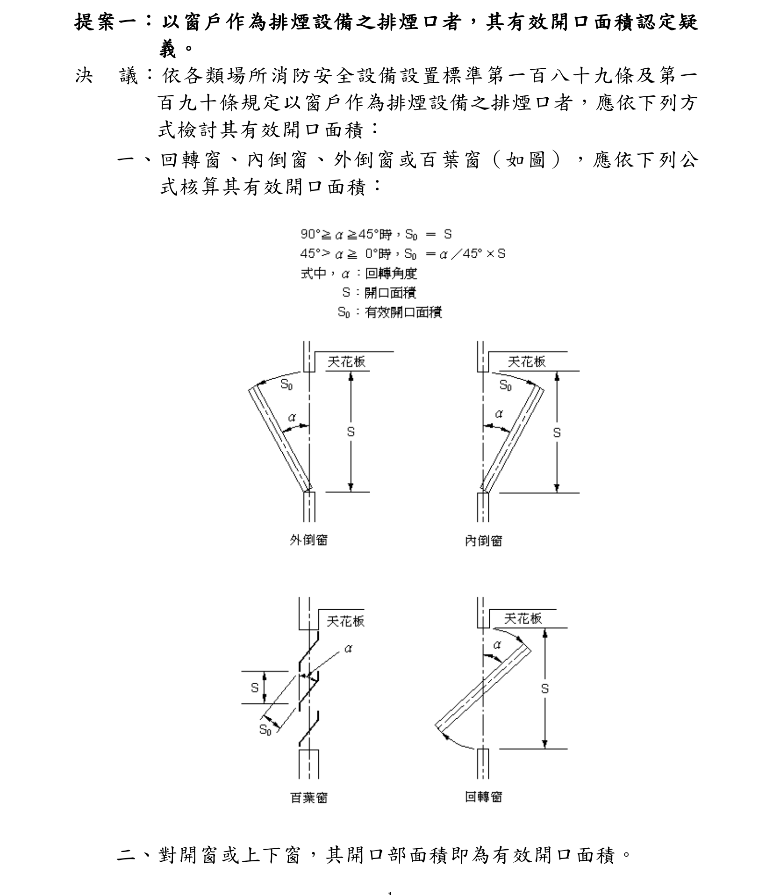

# 排煙窗法規檢討

## 使用情境

- 建築師需要判定建築物是否須設排煙設備時
- 檢討排煙窗有效面積是否符合法規要求時
- 需要釐清建築技術規則與消防設置標準的雙軌排煙規定時
- 進行防煙區劃規劃與排煙口配置時
- 審查或自主檢查建築物排煙合規性時

## 學習目標

- 理解排煙義務的三個觸發入口（無開口樓層、特定用途場所、無窗居室）
- 掌握排煙窗有效面積的計算方法與折減係數
- 了解防煙區劃的基本要求與設計原則
- 熟悉 §101 補充規定（排風量、中央管理室）

## 法規體系

排煙義務有兩套平行法規體系，必須同時滿足，取嚴格者：

| 體系 | 法源 | 觸發條件條文 | 設計規範條文 |
|------|------|-------------|-------------|
| **建築法** | 建築技術規則（設計施工編） | §100 | §101、§102 |
| **消防法** | 各類場所消防安全設備設置標準 | §28 | §188、§189 |

## 排煙義務觸發條件

排煙義務有三個獨立的觸發入口，任一成立即須設排煙設備：

### 入口 A：無開口樓層（消防 §4 + §28③）

**有效開口條件**（須全部滿足）：
- 可內切直徑 ≥ 50cm 之圓
- 開口下緣距地板 ≤ 120cm
- 面臨道路或寬度 ≥ 1m 之通路
- 無柵欄遮擋、玻璃厚度 ≤ 6mm（可由外部擊破）
- 十層以下樓層另需至少 2 個大型開口（可內切直徑 ≥ 1m 之圓，或寬 ≥ 75cm × 高 ≥ 120cm）

**判定**：有效開口面積 < 樓地板面積 × 1/30 → 認定為「無開口樓層」

**後果**：樓地板面積 ≥ 1,000 m² 之無開口樓層，須設排煙設備（§28③）

### 入口 B：特定用途場所（建技規 §100① + 消防 §28①）

不需逐窗計算，以場所類別與面積門檻觸發：
- 建技規 §100①：第 69 條第一、四類等用途，每層樓地板面積 > 500 m²
- 消防 §28①：第 12 條第 1 款等指定場所，面積 ≥ 500 m²

### 入口 C：無窗居室（建技規 §1 第 35 款第三目 + §100②）

**條件**：樓地板面積 > 50 m² 之居室，天花板下方 80cm 範圍內之有效通風面積 < 樓地板面積 × 2%

**判定**：符合上述條件者認定為「無窗居室」，須依 §100② 設排煙設備

## 防煙區劃

**法源**：建技規 §101

- 每 500 m² 以防煙壁區劃為一個排煙區劃
- 防煙壁定義：自天花板下垂 50cm 以上之不燃材料垂壁
- 單一房間面積 > 500 m² 時，須以防煙壁進一步分割

## 排煙窗有效面積計算

**法源**：建技規 §101① + 消防 §188③⑦

### 計算規則

1. **有效帶範圍**：天花板高度往下 80cm 的區間（即天花板高度 − 80cm ～ 天花板高度）
2. **逐窗計算**：
   - 窗頂若超過天花板 → 截斷至天花板高度
   - 帶內高度 = min(窗頂, 天花板) − max(窗台高, 有效帶下緣)
   - 帶內面積 = 窗寬 × 帶內高度
   - 有效面積 = 帶內面積 × 開啟折減係數
3. **合規判定**：Σ 有效面積 ≥ 排煙區劃面積 × 2%
4. **水平距離**：排煙口任一點至最遠防煙區劃部分之水平距離 ≤ 30m

### 排煙窗有效開口面積計算（解釋令）

**法源**：消防署 92 年 9 月 1 日內授消字第 0920093655 號解釋令提案一

依各類場所消防安全設備設置標準 §189、§190 規定，以窗戶作為排煙設備之排煙口者，應依下列方式檢討其有效開口面積：

#### 一、回轉窗、內倒窗、外倒窗或百葉窗

依開啟角度 α 核算有效開口面積：

| 開啟角度 α | 有效開口面積 So | 白話說明 |
|-----------|---------------|---------|
| 90° ≥ α ≥ 45° | So = S | 角度 ≥ 45° 時，有效面積 = 全開面積 |
| 45° > α ≥ 0° | So = (α / 45°) × S | 角度 < 45° 時，依比例折減 |

其中：
- **α**：回轉角度（開啟角度）
- **S**：開口面積（窗戶在有效帶範圍內的面積）
- **So**：有效開口面積

> **白話來說**：只要窗戶能打開 45 度以上，有效面積就等同全開；不到 45 度的話，有效面積按比例縮減。例如開 30 度的窗，有效面積 = 30/45 × S ≈ 0.67S。

#### 二、對開窗或上下窗（橫拉窗、上下拉窗）

開口部面積即為有效開口面積（So = S）。

#### 三、固定窗

固定窗無法開啟，排煙無效（So = 0）。

#### 計算範例

| 窗戶類型 | 開口面積 S | 開啟角度 α | 有效開口面積 So |
|---------|----------|----------|--------------|
| 外倒窗 | 1.2 m² | 60° | 1.2 m²（≥ 45°，全額） |
| 內倒窗 | 1.0 m² | 30° | 0.67 m²（30/45 × 1.0） |
| 橫拉窗 | 0.8 m² | — | 0.8 m²（開口部 = 有效面積） |
| 固定窗 | 1.5 m² | — | 0 m²（無法開啟） |

### 面積門檻

- 樓地板面積 > 50 m² 之居室才需檢討（建技規 §1 第 35 款第三目）

## §101 補充規定

### 排風量

> 排風機應能隨排煙口之開啟而自動操作，其排風量**不得小於每分鐘 120 立方公尺**。

- 此為機械排煙系統之規定
- 採自然排煙（排煙窗）者不適用，但仍應確認排煙窗之自然通風量足夠

### 中央管理室

> 建築物高度超過 **30 公尺**或地下層面積超過 **1,000 平方公尺**者，排煙設備之控制應設置於中央管理室。

**觸發條件**（任一成立）：
- 建築物高度 > 30m
- 地下層總面積 > 1,000 m²

**中央管理室**（又稱防災中心、中控室）須能集中監控排煙設備之啟閉狀態。

## 常見改善策略

當排煙窗有效面積不足時，常見的改善方式：

1. **固定窗改為可開啟窗**：將有效帶範圍內的固定窗改為平開或外推窗
2. **窗戶上移或加高**：使更多窗面積落入有效帶範圍
3. **新增窗戶**：於有效帶範圍內增設排煙窗
4. **改採機械排煙**：當自然排煙不可行時，改用機械排煙系統（須符合排風量要求）

## 參考法規與標準

- 建築技術規則設計施工編 §1（用語定義）、§100-102（排煙設備）
- 各類場所消防安全設備設置標準 §4（無開口樓層）、§28（排煙設備設置場所）、§188-189（排煙設備構造）
- 建築技術規則設計施工編 §69（建築物使用類組）
- 消防署 92 年 9 月 1 日內授消字第 0920093655 號解釋令提案一（排煙窗有效開口面積認定）
